# Mermaid Class Diagram Cheat Sheet

[Back to Wiki Home](home.md)

Mermaid class diagrams let you describe object-oriented structure in text that is easy to diff, review, and keep close to the code. They work well for conceptual modeling, design discussions, domain modeling, and lightweight technical documentation.

---

## When to Use Class Diagrams

Use class diagrams when you want to describe structure rather than runtime behavior.

- **Conceptual modeling:** Sketch the major domain concepts and how they relate before implementation details settle.
- **Detailed design:** Capture classes, members, and relationships in a form that can guide code structure.
- **Data and domain modeling:** Show entities, ownership, and multiplicity in a compact format.
- **Documentation close to code:** Keep architecture notes in Markdown rather than in external drawing tools.

If you need to describe order of execution, message flow, or process steps, a sequence diagram or flowchart is often a better fit.

---

## Basic Structure

Every Mermaid class diagram starts with the `classDiagram` keyword.

There are two main ways to define classes:

- **Explicit declaration:** `class Animal`
- **Implicit declaration through a relationship:** `Vehicle <|-- Car`

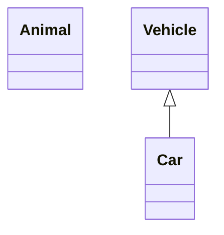

### Class Names and Labels

Class names should normally use letters, numbers, underscores, or dashes. If you need a friendlier display label or special characters, use a label or escape the class name with backticks.

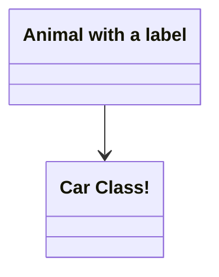

---

## Members

Mermaid treats entries with parentheses `()` as methods and entries without parentheses as attributes.

You can define members one line at a time with `:` or group them inside `{}`.

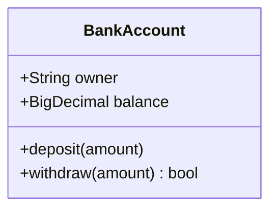

### Visibility and Classifiers

Use these prefixes and suffixes on members:

| Marker | Meaning |
| :--- | :--- |
| `+` | Public |
| `-` | Private |
| `#` | Protected |
| `~` | Package or internal |
| `*` | Abstract method suffix |
| `$` | Static member suffix |

Examples:

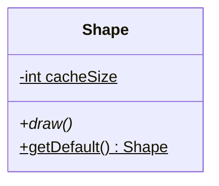

### Return Types

Return types go after the closing `)` and must be separated by a space.

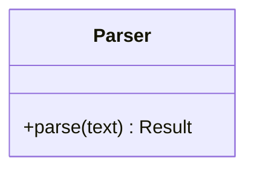

### Generic Types

Generics use tildes `~type~`.

- Nested generics are supported.
- Generics with commas are not currently supported.
- When a class is declared as generic, the generic part is not treated as part of the class identity when you reference that class elsewhere.

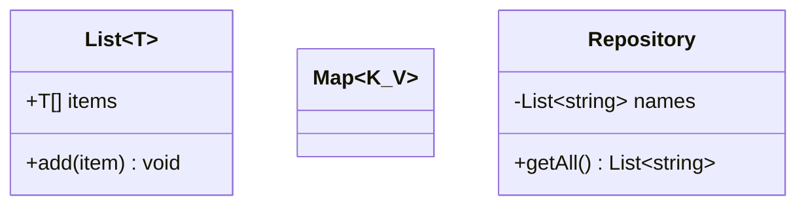

---

## Relationships

Mermaid supports these class relationship operators:

| Syntax | Meaning |
| :--- | :--- |
| `<|--` | Inheritance |
| `*--` | Composition |
| `o--` | Aggregation |
| `-->` | Association |
| `--` | Solid link |
| `..>` | Dependency |
| `..|>` | Realization |
| `..` | Dashed link |

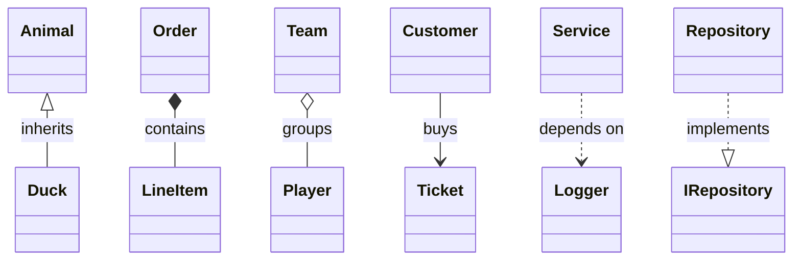

### Labels and Direction

Add a label after `:` to explain the relationship. Reverse arrowheads are also allowed, and Mermaid supports two-way relations when you need a bidirectional association.

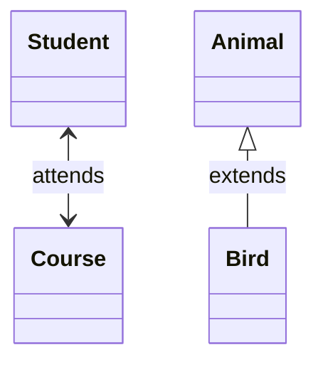

### Cardinality or Multiplicity

Put multiplicities in quotes near the ends of the relationship.

Common values:

- `1`
- `0..1`
- `1..*`
- `*`
- `n`
- `0..n`
- `1..n`

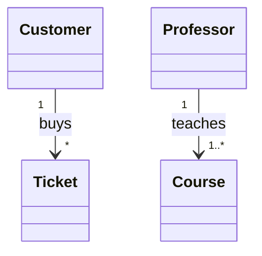

### Lollipop Interfaces

Lollipop notation connects a class to an interface-shaped endpoint.

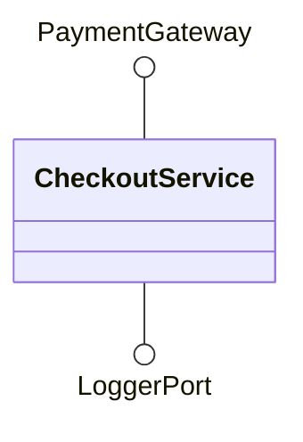

Each lollipop interface is unique in Mermaid and is not intended to be reused across several classes.

---

## Annotations and Structure

### Stereotypes

Use `<< >>` annotations to mark intent such as `interface`, `abstract`, `service`, or `enumeration`.

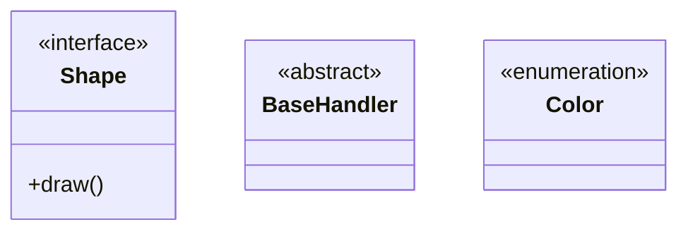

### Namespaces

Use `namespace` to group related classes.

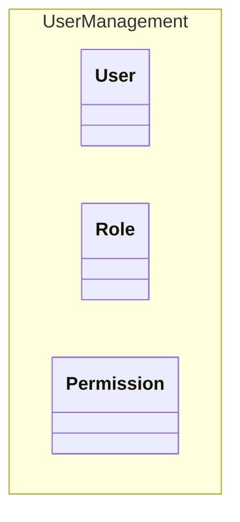

### Notes

Use notes for short clarifications. Standalone notes apply to the diagram; `note for` attaches a note to a class.

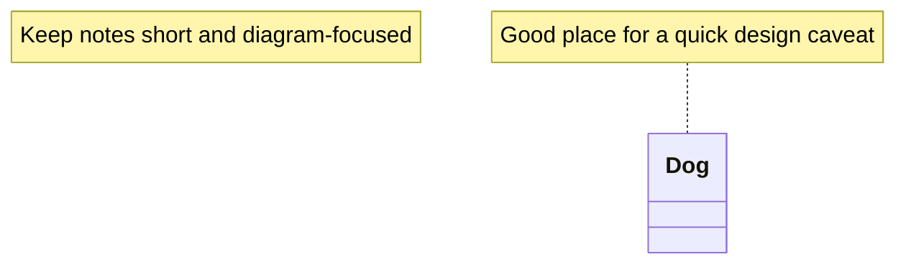

### Comments

Lines that start with `%%` are comments and are ignored by the parser.

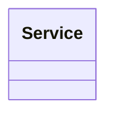

---

## Layout, Interaction, and Styling

### Direction

Use `direction` to control layout.

- `TB` top to bottom
- `BT` bottom to top
- `LR` left to right
- `RL` right to left

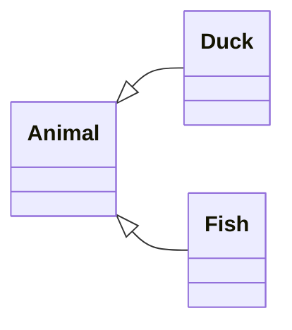

### Interaction

You can attach links or callbacks to classes. This only works when Mermaid is configured with `securityLevel='loose'`.

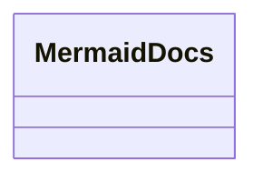

### Styling

You can style a node directly, define reusable style classes, or define a `default` class for all nodes.

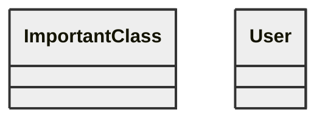

Notes and namespaces cannot be styled individually, though they still respond to theme-level styling.

### Configuration

One useful class diagram setting is `hideEmptyMembersBox`, which removes empty member compartments from classes that only show a name.

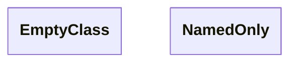

---

## Practical Advice

- Keep class diagrams focused. Split large domains into multiple diagrams instead of forcing everything into one view.
- Prefer relationship labels that explain meaning, such as `owns`, `creates`, or `depends on`.
- Use notes for caveats, not for paragraphs of prose.
- Keep names stable so diagram diffs stay readable over time.
- Mermaid support varies by host application and embedded Mermaid version. If valid syntax fails, check the renderer version.
- Test complex diagrams in the [Mermaid Live Editor](https://mermaid.live/) or against the [official class diagram docs](https://mermaid.js.org/syntax/classDiagram.html).
